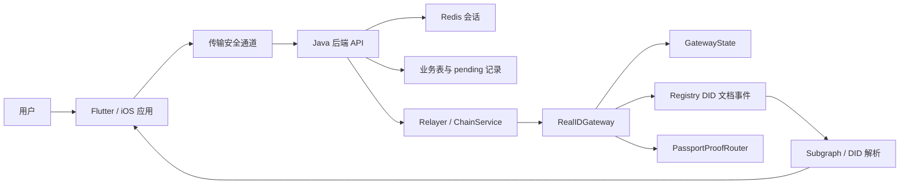

# RealID 中文需求规格

## 1. 文档范围

本文档从现有 Flutter 前端、iOS 原生、Java 后端和 Solidity 合约反向梳理 RealID 产品需求，输出以需求为主，不覆盖完整开发设计、接口字段字典或部署手册。[[ REQ-019, REQ-015 ]]

分析方法遵循 `/Users/jieli/development/spec-driven/存量代码转spec的skill/SKILL.zh.md`：先建立代码图谱，再抽取洞察，最后用可追溯引用生成需求规格。[[ ARCH-002, ARCH-003 ]]

## 2. 需求总览

RealID 是围绕 DID 生命周期、端侧密钥、安全通道、护照 ZKP、设备迁移、社交恢复和实时核身构建的身份系统。[[ REQ-003, REQ-006, REQ-008, REQ-011, REQ-012, REQ-015 ]]

系统边界包含端侧应用、后端服务、链上 DID 状态机与 Registry 事件源，端侧负责密钥和流程编排，后端负责会话、校验、业务记录和 relayer 调用，合约负责最终链上状态约束。[[ ARCH-001, ARCH-002, ARCH-003, ARCH-004 ]]

## 3. 账号注册

### 3.1 邮箱验证码

当用户发起注册时，系统应发送注册邮箱验证码，并返回 `emailVerificationSessionId`。[[ REQ-001 ]]

当用户提交验证码时，系统应校验验证码会话，并在成功后返回 `emailVerificationValidSessionId`，供注册资料合法性校验使用。[[ REQ-001 ]]

若注册邮箱已存在或处于不同注册类型，系统应通过 `registrationType` 暴露后续处理分支。[[ REQ-001 ]]

### 3.2 注册资料合法性校验

当用户完成邮箱验证码校验后，系统应校验真实姓名、头像、DID 标识、邮箱有效会话和邀请码。[[ REQ-002 ]]

校验通过时，系统应创建注册进度并返回 `userRegistrationProgressSessionId` 与 `accountId`。[[ REQ-002 ]]

若资料缺失、邮箱会话无效或服务端业务规则不通过，系统应返回后端业务错误码，并停止进入上链阶段。[[ REQ-002 ]]

### 3.3 注册上链

当注册资料合法性校验通过后，端侧应加载注册 action 配置，并使用本地密钥构建注册 EIP-712 材料。[[ REQ-003, REQ-017 ]]

注册上链请求必须包含 DID 文档 payload、payload hash、`dataToSign`、用户签名、设备签名和增强用户签名。[[ REQ-003 ]]

当后端提交注册上链时，链上 Gateway 应校验授权 relayer、版本、actionCode 1、nonce、deadline、设备签名和服务端签名。[[ REQ-003, REQ-015 ]]

若链上已存在相同 `didIdKey`，系统应拒绝重复注册。[[ REQ-003, REQ-015 ]]

### 3.4 注册结果比对与回滚

当注册交易确认后，端侧应查询链上或索引器 DID 文档，并与本地期望 DID 文档比对。[[ REQ-003 ]]

当 DID 文档比对成功时，系统应上传比对结果，并完成注册闭环。[[ REQ-003 ]]

当 DID 文档比对失败时，系统应触发注册回滚或用户回滚流程，避免本地状态与链上状态长期不一致。[[ REQ-003, REQ-010 ]]

## 4. 登录与会话

### 4.1 设备指纹登录

当本地存在可复用身份且设备 ID 与 TEE/设备指纹一致时，系统应支持设备指纹自动登录。[[ REQ-004 ]]

设备指纹登录成功后，后端应创建 Redis 登录有效会话，并返回 `loginValidSessionId` 与 `accountStatus`。[[ REQ-004 ]]

若本地身份缺失、重装残留身份未确认、设备 ID 不一致或账户不在运行态，系统应阻止自动登录并返回对应流程状态。[[ REQ-004 ]]

### 4.2 邮箱登录

当设备指纹登录不可用或用户选择邮箱登录时，系统应通过邮箱登录创建登录有效会话。[[ REQ-004 ]]

若邮箱未注册，系统应返回邮箱登录要求或账号不存在类错误，而不是创建登录会话。[[ REQ-004 ]]

### 4.3 登录态复用

当本地存在未过期且账户状态可复用的登录会话时，系统可复用 `loginValidSessionId` 进入已登录态。[[ REQ-004 ]]

若账户处于密钥更新、注销、恢复或其他非运行态，系统不得直接复用本地登录态。[[ REQ-004, REQ-020 ]]

## 5. 传输安全

### 5.1 安全通道协商

当客户端准备调用业务接口前，系统应通过 `/api/v1/security/channel/initiate` 建立传输安全通道。[[ REQ-005, API-001 ]]

客户端应生成 ECDH 临时密钥与 nonce，构建 ClientPacket，用服务端预置公钥加密，并对客户端包签名。[[ REQ-005 ]]

服务端应校验客户端公钥包与签名，生成服务端包、会话 key、服务端签名和加密后的客户端 nonce，并将会话写入 Redis。[[ REQ-005 ]]

客户端应校验服务端签名、解密 nonce，并用 ECDH shared secret 与双方 nonce 派生 AES key/IV。[[ REQ-005 ]]

### 5.2 请求加密和响应解密

当业务请求发出时，客户端应加入 `biz_sequence_id`、`biz_time`、`app_id`、`version` 等公共参数。[[ REQ-005 ]]

当目标接口需要签名时，客户端应按字段排序规则生成待签名字符串，并按配置使用内置私钥、设备私钥或用户私钥签名。[[ REQ-005, REQ-017 ]]

业务请求体应使用安全通道 AES-GCM 加密为 `trans_data`，并携带 `trans_session_id`。[[ REQ-005 ]]

当服务端响应返回时，客户端应解密 `trans_data`，并在目标接口要求时校验服务端响应签名。[[ REQ-005 ]]

## 6. 端侧密钥与生物识别

系统应支持生成、读取、签名、验签和删除 Ed25519 密钥对。[[ REQ-017 ]]

系统应支持生成、读取和使用 P-256 Secure Enclave 密钥，并支持 DER 签名转 R/S 格式。[[ REQ-017 ]]

当注册、轮换、迁移、注销等敏感流程需要签名时，系统应使用当前 active key tags 读取对应密钥。[[ REQ-017 ]]

当敏感签名需要用户确认时，系统应支持开启和清理生物识别会话。[[ REQ-017 ]]

若批量签名的 tags 与 messages 数量不一致，系统应返回失败并停止继续构造签名结果。[[ REQ-017 ]]

## 7. 护照升级与 ZKP

当已登录用户发起护照升级时，系统应先确认没有未完成的密钥轮换 pending。[[ REQ-006, REQ-020 ]]

系统应读取护照证明材料，并构建护照 ZKP 材料。[[ REQ-006 ]]

若护照明文个人信息未确认删除，系统应停止升级流程。[[ REQ-006 ]]

升级 validation 应提交登录有效会话、DID alias key、护照算法、identifier、护照有效期、签发国和 DSC 证书等材料。[[ REQ-006 ]]

validation 通过后，系统应保存升级 pending，并返回 `userUpdateProgressSessionId`。[[ REQ-006, REQ-020 ]]

当升级上链时，Gateway 应校验 actionCode 2、当前 key set、用户类型、nonce、deadline、设备签名、服务端签名和 ZK proof。[[ REQ-006, REQ-015, REQ-016 ]]

若 ZK proof 为空、算法 verifier 未配置、公开信号不合法或 proof 验证失败，系统应拒绝升级上链。[[ REQ-006, REQ-016 ]]

## 8. 用户密钥轮换

当用户发起密钥轮换时，系统应要求存在有效登录会话。[[ REQ-007 ]]

若本地已存在密钥轮换 pending，系统应优先恢复上一笔轮换闭环，而不是重复提交。[[ REQ-007, REQ-020 ]]

系统应生成新的用户公钥、增强用户公钥和设备公钥，并构建密钥更新上链请求。[[ REQ-007, REQ-017 ]]

后端 `/api/v1/did/key/rotate` 应创建密钥轮换记录、更新账户状态并返回上链处理结果。[[ REQ-007, API-002 ]]

当密钥轮换上链时，Gateway 应校验 actionCode 3、旧 key set、用户类型、nonce、deadline、用户设备签名和服务端签名。[[ REQ-007, REQ-015 ]]

当链上 DID 文档与本地预期不一致时，系统应触发用户回滚或上传失败比对结果。[[ REQ-007, REQ-010 ]]

## 9. 设备迁移

### 9.1 新设备二维码

当新设备准备迁入 Real ID 时，系统应生成新设备密钥材料，并生成迁移二维码 payload。[[ REQ-008 ]]

迁移二维码 payload 应包含迁移会话、新设备 ID、nonce、时间戳、版本、新设备型号、codeTag、新用户/增强用户/设备公钥和二维码签名。[[ REQ-008 ]]

若新设备密钥材料首次读取失败，系统应按配置进行短间隔重试。[[ REQ-008 ]]

### 9.2 旧设备发起迁移

当旧设备扫码发起迁移时，系统应要求旧设备存在登录会话，并检查没有未解决的密钥轮换 pending。[[ REQ-008, REQ-020 ]]

后端应解析二维码 TLV，提取 `migrationSessionId`、新设备 ID、新设备型号和新设备公钥，并创建设备迁移记录。[[ REQ-008 ]]

若二维码 TLV 为空、payload 缺失、账户不存在或迁移会话非法，系统应返回业务错误并停止流程。[[ REQ-008 ]]

### 9.3 迁移上链与同步

当迁移上链时，Gateway 应校验 actionCode 5 或 7、旧 key set、新 key set、nonce、deadline、签名和服务端 receipt。[[ REQ-008, REQ-015 ]]

当迁移通过审批路径执行时，Gateway 应消费有效的 `approvalData`，否则拒绝迁移。[[ REQ-008, REQ-015 ]]

迁移状态查询应返回账户状态、旧设备型号、新设备 ID、当前绑定设备 ID、DID ID、迁移状态、账号同步状态、登录会话可用性和用户信息。[[ REQ-008 ]]

当迁移确认后，系统应上传 DID 文档比对结果，并在成功时同步新设备登录态。[[ REQ-008 ]]

## 10. Real ID 注销

当用户发起注销前，系统应先检查是否存在注销 pending。[[ REQ-009, REQ-020 ]]

只有活动状态的 Real ID 可以发起注销，已注销、注销中或非运行态账号不得重复注销。[[ REQ-009 ]]

注销前系统应检查没有未完成的密钥轮换 pending。[[ REQ-009, REQ-020 ]]

注销前系统应检查链上 key set 与本地 key set 一致；若不一致，系统应保持账户运行态并提示失败原因。[[ REQ-009 ]]

当注销上链时，Gateway 应校验 actionCode 4、当前 key set、用户类型、nonce、deadline、用户设备签名和服务端签名，并撤销 DID 文档。[[ REQ-009, REQ-015 ]]

## 11. 用户回滚与无效化

当注册、升级、密钥轮换或设备迁移的链上 DID 文档比对失败时，系统应触发用户回滚。[[ REQ-010 ]]

若已经存在用户回滚 pending，系统应跳过重复提交，并继续查询或恢复原 pending。[[ REQ-010, REQ-020 ]]

回滚请求应携带账号 ID、DID key、设备 ID、来源 actionCode、来源 requestId/txHash、原因和 DID 文档比对详情。[[ REQ-010 ]]

Gateway 只应允许无效化最近一次存在 undo 数据的可回滚动作。[[ REQ-010, REQ-015 ]]

回滚完成后，系统应清理 pending 或根据链上/后端状态更新本地生命周期状态。[[ REQ-010, REQ-020 ]]

## 12. 社交恢复

当用户发起社交恢复前，系统应检查本机是否存在 Real ID。[[ REQ-011 ]]

若本机 Real ID 使用相同邮箱且处于可登录状态，系统应建议用户登录而不是恢复。[[ REQ-011 ]]

若本机 Real ID 属于不同邮箱或处于异常状态，系统应在继续恢复前提示本地数据会被清理或覆盖。[[ REQ-011 ]]

社交恢复应先触发恢复邮箱验证码，并在成功后返回恢复用验证码 session。[[ REQ-011 ]]

发起恢复时，系统应提交邮箱、验证码、设备 ID、设备公钥和签名材料，并返回恢复会话。[[ REQ-011 ]]

组员应能查询恢复消息并提交签名消息验证。[[ REQ-011, REQ-014 ]]

恢复确认应返回 `ridacId`、`didId`、`didDoc`、账户状态和 requestId，并保存恢复 pending。[[ REQ-011, REQ-020 ]]

恢复确认后，系统应执行终端数据核验；若核验失败，系统应提示用户重启恢复。[[ REQ-011 ]]

> 🔍 UNKNOWN: 社交恢复群组门限人数和签名聚合规则需要继续从 service 层和产品流程图确认。[[ REQ-011 ]]

## 13. 实时核身

当用户对好友发起实时核身时，系统应校验好友关系，并创建核身消息。[[ REQ-012 ]]

发起实时核身成功后，系统应返回 `serialNumber` 和服务端验证码。[[ REQ-012 ]]

被核身方确认时，系统应校验服务端验证码与 App 验证码。[[ REQ-012 ]]

若验证码不一致，系统应将消息标记为验证失败，并返回验证码不一致错误。[[ REQ-012 ]]

若验证码一致，系统应将 `verifyStatus` 更新为 `00` 并返回核身成功状态。[[ REQ-012 ]]

发起方应能分页查询实时核身记录，并可按 `serialNumber` 或好友 DID 过滤。[[ REQ-012 ]]

## 14. 社交关系、群组与消息中心

系统应支持二维码校验和添加社交链接。[[ REQ-013 ]]

系统应支持好友列表查询和好友备注更新。[[ REQ-013 ]]

系统应支持群组创建发起、群组创建确认、群组列表、群组更新发起、群组更新确认和群组记录查询。[[ REQ-013 ]]

当查询群组记录时，系统应校验当前账号是否为群主或拥有操作权限。[[ REQ-013 ]]

系统应提供消息列表、消息验证、未读状态、新消息状态和已读状态更新接口。[[ REQ-014 ]]

消息中心应支撑社交恢复、群组更新和实时核身等需要异步处理的流程。[[ REQ-014 ]]

> 🔍 UNKNOWN: 消息类型枚举和群组成员签名协议需要继续从 service 层、数据库枚举或接口文档补齐。[[ REQ-013, REQ-014 ]]

## 15. 链上 DID 生命周期

Gateway 应统一处理注册、护照更新、密钥轮换、注销、设备迁移、迁移审批和无效化动作。[[ REQ-015 ]]

所有链上业务动作都必须由授权 relayer 调用。[[ REQ-015 ]]

所有链上业务动作都必须校验 `authVersion`、`actionCode`、`nonce`、`deadline`、用户设备签名和服务端签名。[[ REQ-015 ]]

注册动作应拒绝已注册 DID，非注册动作应拒绝未注册 DID。[[ REQ-015 ]]

更新、轮换、迁移、注销和无效化动作应校验当前用户类型和当前 key set。[[ REQ-015 ]]

State 合约应维护 DID 是否注册、nonce、alias、alias 历史、当前 key set hash 和 DID 状态。[[ REQ-015 ]]

Registry 应作为 DID 文档事件源，记录 attribute/delegate/owner 变更。[[ REQ-015 ]]

DidDocWriter 应统一写入注册、护照更新、密钥轮换、设备迁移和撤销相关 DID 文档属性。[[ REQ-015 ]]

## 16. ZK Proving Key 与证明校验

系统应提供 ZK proving key 查询能力，供端侧生成护照 ZKP。[[ REQ-016 ]]

链上 PassportProofRouter 应按 `passportAlgo` 选择 Groth16 verifier。[[ REQ-016 ]]

链上 proof 校验应使用 `issuerPubkeyHash` 和 `identifier` 作为公开信号。[[ REQ-016 ]]

若 `issuerPubkeyHash` 或 `identifier` 超出 BN254 标量域，系统应判定 proof 无效。[[ REQ-016 ]]

若指定算法没有 verifier，系统应判定 proof 无效。[[ REQ-016 ]]

## 17. 匿名证明与身份承诺

iOS 原生侧应通过 Rust SDK FFI 支持生成用户密钥对。[[ REQ-018 ]]

iOS 原生侧应支持生成 EdDSA 签名和身份承诺。[[ REQ-018 ]]

iOS 原生侧应支持输入群组成员身份承诺、私钥、消息、scope 和 Merkle tree depth 生成匿名群组授权证明。[[ REQ-018 ]]

调用 FFI 返回字符串后，调用方应按 SDK 要求释放内存。[[ REQ-018 ]]

## 18. 前端页面与用户体验

系统应提供启动页、登录/注册页、验证码页、资料设置页、首页、连接页、通知页、设置页和个人资料页面。[[ REQ-019 ]]

系统应提供设备迁移、用户升级、用户密钥轮换、社交恢复、实时核身和账号注销页面或流程入口。[[ REQ-019 ]]

当用户进入受保护页面时，系统应根据生命周期状态判断是否允许进入。[[ REQ-019, REQ-020 ]]

> 🔍 UNKNOWN: 当前发行版本是以 Flutter 页面为主、iOS 原生页面为主，还是两者并存，需要项目侧确认。[[ REQ-019 ]]

## 19. Pending 恢复与流程互斥

当注册、升级、密钥轮换、设备迁移、注销、社交恢复或回滚进入异步上链/确认阶段时，系统应保存 pending 状态。[[ REQ-020 ]]

当用户重进应用或再次发起同类流程时，系统应优先恢复未完成 pending。[[ REQ-020 ]]

当同类 pending 已存在时，系统不得重复提交新的上链请求。[[ REQ-020 ]]

当某流程与密钥轮换 pending 互斥时，系统应先恢复或解决密钥轮换，再允许发起该流程。[[ REQ-020 ]]

当 pending 完成、失败或被用户明确重启时，系统应清理或更新本地 pending 快照。[[ REQ-020 ]]

> 🔍 UNKNOWN: 不同流程 pending 的最大保留时长和用户可手动放弃规则需要产品侧补充。[[ REQ-020 ]]

